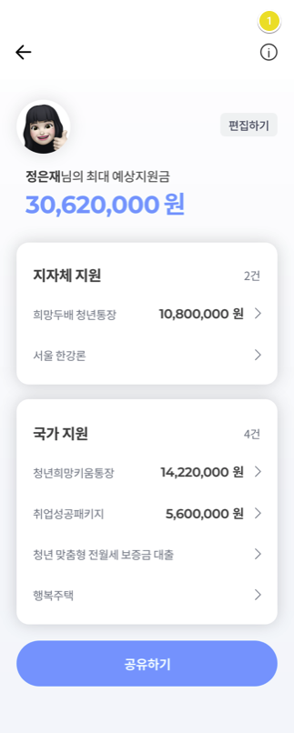
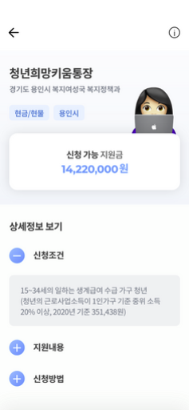
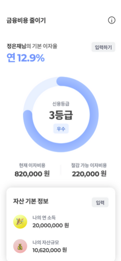
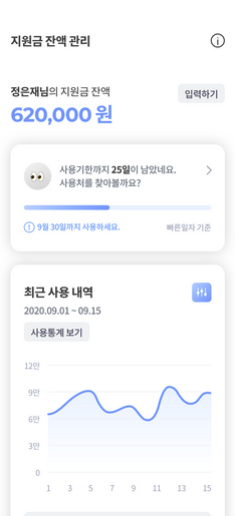

<h1 align="center"> 💰Support Connection💰 </h1>
<p align="center">
  
</p>

> 서폿커넥션은 사용자 맞춤 정부 지원금 신청 및 자산 관리 서비스입니다.

### [👋 Android Link 👋](https://github.com/kimsutto/support-connection-front)

<br/>

### 주제 선정 이유
> 현재 중앙정부 및 지방정부, 공공기관 등에서 다양한 지원제도를 제공하고 있으나 그 방대함으로 인해 실제 수요자에게 인식되는 수는 많지 않고, 사용자 역시 적재적소에 지원제도를 활용하지 못하고 있다. <br/>
이에, 자신에게 해당되는 지원 정보를 효율적으로 제공하고 효과적으로 활용할 수 있도록 기획하였다.<br/>
개인 가구는 인지하지 못했던 지원 제도를 활용하여 생활비를 절감할 수 있으며, 금융비용을 절감하여 가처분 소득을 증진시킬 수 있다.<br/> 
또한 자영업자는 현재와 같은 위기 상황에서 각종 세금/비용 감면과 금융지원을 빠르게 확인하여 생존력을 높일수 있다.

<br/>
<br/>

### 기술 스택

| FrontEnd        | BackEnd  | Etc       |
| ---------------- | --------- | ------------ |
| `Android`          | `SpringBoot` | `NginX` |
|    | `MySQL` |     `NCP`      |

<br/>
<br/>


### 아키텍처 

### 화면 구성 및 기능 

<table>
  <tr>
    <th></th>
    <th></th>
    <td></td>
    <td></td>
  </tr>
  <tr>
    <td>나의 예상 지원금 확인하기</td>
    <td>쉬운 지원금 신청하기</td>
    <td>금융 비용 줄이기</td>
    <td>지원금 잔액 관리</td>
  </tr>
</table>


<br/>


## DB

<br/>

## API

<br/>

## Usage

```
git clone <저장소명>
cd <저장소>
java -jar <jar파일명.jar>
```

<br/>

## 담당 

👤 양지원
👤 김수진


## Copyright

## issue
